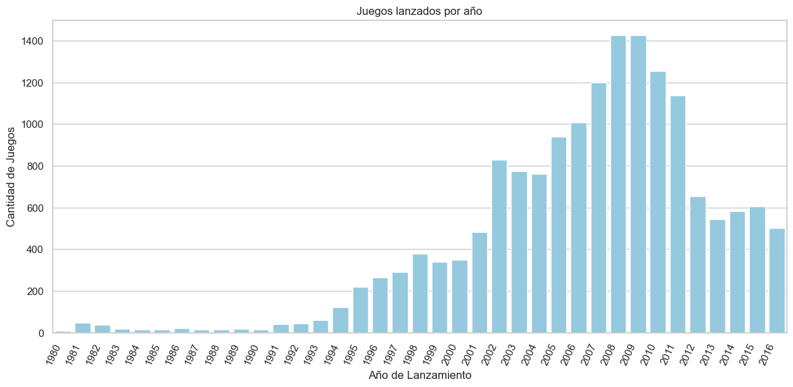

# Sprint 6 - Proyecto Integrado 1

## Descripción del Proyecto
Este proyecto tiene como objetivo analizar datos de ventas de videojuegos, reseñas de usuarios y expertos, y otros factores (géneros, plataformas, etc.) para identificar patrones que determinen el éxito de un juego. La empresa Ice, que vende videojuegos a nivel global, utilizará este análisis para detectar proyectos prometedores y planificar campañas publicitarias efectivas.

Los datos disponibles cubren el período hasta 2016, y se utilizarán para planificar las campañas de marketing para 2017. Este ejercicio proporciona experiencia práctica en el trabajo con datos históricos y la identificación de tendencias clave en la industria de los videojuegos.

## Dataset
El dataset contiene las siguientes columnas:

- Name: Nombre del videojuego
- Platform: Plataforma (Xbox, PlayStation, etc.)
- Year_of_Release: Año de lanzamiento
- Genre: Género del videojuego
- NA_sales: Ventas en Norteamérica (en millones de USD)
- EU_sales: Ventas en Europa (en millones de USD)
- JP_sales: Ventas en Japón (en millones de USD)
- Other_sales: Ventas en otras regiones (en millones de USD)
- Critic_Score: Puntuación de los críticos (máximo de 100)
- User_Score: Puntuación de los usuarios (máximo de 10)
- ESRB_Rating: Clasificación de edad de ESRB (Adolescente, Adulto, etc.)

## Objetivo
El objetivo principal es identificar los factores que contribuyen al éxito de un videojuego en términos de ventas globales, tomando en cuenta factores como la plataforma, género, puntuaciones de usuarios y críticos, y región geográfica.

## Pasos del Proyecto
1. Carga y Exploración de Datos
    - Cargar los datos desde /datasets/games.csv.
    - Explorar la información general del dataset.
    - Preprocesamiento de Datos

2. Limpiar los datos y tratar los valores ausentes.
    - Convertir los tipos de datos según sea necesario.
    - Crear nuevas columnas, como las ventas totales globales.
    - Análisis Exploratorio de Datos (EDA)

3. Analizar el número de lanzamientos de juegos por año.
    - Evaluar las ventas por plataforma y género.
    - Investigar cómo las reseñas afectan las ventas.
    - Comparar las ventas por región (NA, UE, JP).
4. Pruebas de Hipótesis

    - Comparar las calificaciones promedio entre plataformas como Xbox y PC.
    - Comparar las calificaciones entre géneros, como Acción y Deportes.

5. Conclusiones

    - Basado en el análisis, formular conclusiones sobre qué factores predicen el éxito de un videojuego.

## Visualizaciones
Este proyecto incluye varias visualizaciones para analizar los datos, como:

1. Gráfica 1: Juegos lanzados por año

Conclusión: La cantidad de lanzamientos de videojuegos creció de manera constante desde los años 80 hasta alcanzar su punto máximo alrededor de 2008-2009. Después de esto, hubo una disminución notable en el número de lanzamientos anuales. Esto sugiere que la industria alcanzó un pico de saturación, seguido de una consolidación del mercado.

2. Gráfica 2: Top 10 Plataformas con Mayores Ventas Totales
.png)

Conclusión: La PlayStation 2 (PS2) fue la plataforma con las ventas totales más altas, seguida de la Xbox 360 y la PlayStation 3. Esto refleja la popularidad y el éxito comercial de las consolas de Sony y Microsoft en los años 2000 y 2010.

3. Gráfica 3: Ventas Anuales por Plataforma
.png)

Conclusión: Las ventas anuales de las plataformas PS2, Xbox 360 y PS3 muestran que cada plataforma tuvo su ciclo de vida, con la PS2 alcanzando su punto máximo alrededor de 2004-2005, seguida por la Xbox 360 y la PS3 que dominaron hacia finales de los 2000. Después de sus respectivos picos, todas las plataformas experimentaron una caída en las ventas.

4. Gráfica 4: Ventas Totales por Plataforma desde 2010
.png)

Conclusión: Desde 2010, la PS3 y la Xbox 360 fueron las plataformas más exitosas en términos de ventas totales, seguidas por la PS4 y la 3DS. Esto muestra la transición de la generación de consolas hacia nuevas plataformas, con la PS4 comenzando a tomar relevancia.

5. Gráfica 5: Tendencias Anuales de Ventas por Plataforma desde 2010
.png)

Conclusión: La PS4 muestra un crecimiento constante y se convierte en la plataforma más vendida a partir de 2014. Las ventas de la Xbox One y la 3DS también son significativas, aunque con una tendencia a la baja desde 2015. Esto indica una clara ventaja de la PS4 sobre sus competidores más cercanos en ese período.

6. Gráfica 6: Distribución de Ventas Globales de Juegos por Plataforma desde 2010
.png)

Conclusión: Las plataformas como la Xbox 360 y la PS3 muestran una mayor variabilidad en las ventas de sus juegos, mientras que plataformas más recientes como la PS4 y la WiiU tienen distribuciones más compactas. La variabilidad podría deberse a la amplia gama de títulos lanzados en las plataformas más antiguas.

7. Gráfica 7: Críticas de Profesionales vs. Ventas y Reseñas de Usuarios vs. Ventas en PS4
.png)

Conclusión: Existe una correlación positiva entre las críticas profesionales y las ventas de videojuegos en PS4, lo que sugiere que una mejor crítica puede traducirse en mayores ventas. Sin embargo, las reseñas de usuarios no parecen tener un impacto tan directo en las ventas, ya que los juegos con buenas ventas muestran una amplia gama de puntuaciones de usuarios.

8. Gráfica 8: Comparación de Ventas de Juegos Multiplataforma en PS4 vs Xbox One
.png)

Conclusión: En general, los juegos multiplataforma venden más en PS4 que en Xbox One, destacándose juegos como "Call of Duty: Black Ops 3" y "Grand Theft Auto V". Esto sugiere que la PS4 tenía una base de usuarios más grande o más comprometida en comparación con la Xbox One durante el período analizado.

9. Gráfica 9: Ventas Promedio por Juego en cada Género

Conclusión: El género "Shooter" es el más rentable en promedio, seguido por "Plataformas" y "Deportes". Esto indica que los juegos de acción, disparos y deportes tienen un atractivo más amplio entre los consumidores y, por lo tanto, generan mayores ventas promedio en comparación con otros géneros como "Puzzle" o "Aventura".